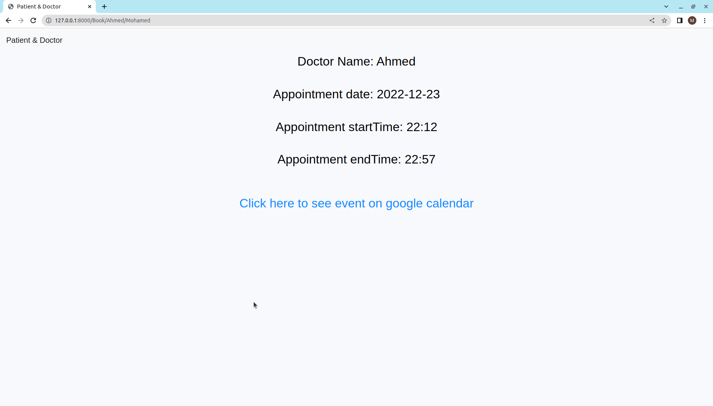

# 
# Patient&Doctor
<table>
<tr>
<td>
  Webapp to register and login by two different types and integrate an appointemnt booking system using Google's calendar API for creating calendar events
</td>
</tr>
</table>

## Table of contents
* [Demo](#demo)
* [Description](#description)
* [Installation and Running](#installation-and-running)
* [Usage](#usage)


## Demo

[Host link](https://google-api-calendar.herokuapp.com/)


## Description

My website called Patient&Doctor which allows registering and let doctors only to share new blogs by just four categories i stored in database and doctors have choice to draft these blogs not even visible to patients or not, also the app allow patients to book an appointment with the doctor using Google's calendar API for creating calendar events


## Installation and Running

- install requirments.txt in your virtual environment 
`pip install -r requirments.txt`

- Cake and apply the migrations by running

    ``` bash
    python manage.py makemigrations

    python manage.py migrate
    ``` 
    
- Run the server

    ```bash
    python manage.py runserver
    ```
- Finally, goto the website on 127.0.0.1:8000


## Usage

1- Register by patient or doctor
# 
2- if you login by patient you can see doctors and thier blogs which not be drafted and book appointment with any of them and see the event created in google api calendar and the appointment will end after 45 mins
# 
# 
# 
# 

3- if you login by doctor you can create new blog and make it drafted or not
# 
# 
# 


